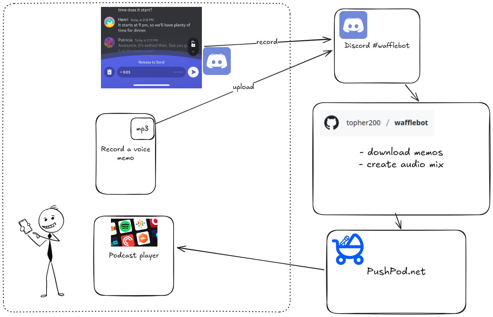

# WaffleBot

WaffleBot is a Discord bot that collects voice memos from a channel, combines
them into a single audio file with intro, outro, and interlude music, and
uploads the result to Dropbox and AWS S3.

## Overview



- **file-downloader**: Downloads voice memos from Discord
- **audio-mixer**: Combines memos with music into a podcast audio file
- **publish-to-dropbox**: Publishes the podcast audio to Dropbox with versioned naming ([details](src/publish-podcast-to-dropbox/README.md))
- **publish-podcast-to-s3**: Publishes the podcast audio to AWS S3 with ISO 8601 timestamps ([details](src/publish-podcast-to-s3/README.md))
- **update-rss-feed**: Generates and updates RSS feed from all S3 podcast files ([details](src/update_rss_feed/README.md))

## Infrastructure

WaffleBot includes AWS infrastructure for hosting the podcast with a custom domain:

- **Private S3 bucket** - Stores podcast files and RSS feed securely
- **CloudFront CDN** - Fast global delivery with custom domain support
- **HTTPS certificate** - Automatic SSL via AWS Certificate Manager
- **Origin Access Control** - Blocks direct S3 access, only allows CloudFront
- **Multi-environment support** - Separate staging and production deployments

### Setup

1. **Configure your environments:**

   ```bash
   cd infra/terraform
   
   # Copy example files and customize with your values
   cp podcast/podcast.tfvars.example podcast/staging.tfvars
   cp podcast/podcast.tfvars.example podcast/prod.tfvars
   cp test-files/test-files.tfvars.example test-files/test-files.tfvars
   
   # Edit each file with environment-specific values
   # staging.tfvars: podcast_bucket_name = "my-podcast-staging", podcast_domain_name = "staging-podcast.mydomain.com"
   # prod.tfvars: podcast_bucket_name = "my-podcast-prod", podcast_domain_name = "podcast.mydomain.com"
   # test-files.tfvars: test_files_bucket_name = "my-test-files-bucket"
   ```

2. **Deploy to staging:**

   ```bash
   ./infra/terraform/scripts/deploy-podcast.sh staging
   ```

3. **Deploy to production:**

   ```bash
   ./infra/terraform/scripts/deploy-podcast.sh prod
   ```

4. **Deploy test files bucket:**

   ```bash
   ./infra/terraform/scripts/deploy-test-files.sh
   ```

5. **Deploy everything:**

   ```bash
   ./infra/terraform/scripts/deploy-all.sh
   ```

For detailed infrastructure documentation, see [`infra/terraform/README.md`](infra/terraform/README.md).

## Development

1. **Run unit tests (fast):**

   ```bash
   uv run pytest tests/unit/ -v
   ```

2. **Run end-to-end tests (slow):**

   ```bash
   uv run pytest tests/e2e/ -v
   ```

   Or use the convenience script:

   ```bash
   ./run-e2e-tests.sh
   ```

   The e2e tests will:
   - Download test audio files from URLs (cached locally)
   - Run the complete audio processing pipeline in Docker
   - Verify that files are correctly processed and published

3. **Run all tests:**

   ```bash
   uv run pytest tests/ -v
   ```

## Lefthook Pre-commit Hooks

This project uses [lefthook](https://github.com/evilmartians/lefthook) to run automated checks on Python files before each commit.

To set up lefthook:

1. Install lefthook (choose one method):

   ```bash
   npm install -g @arkweid/lefthook
   # or
   brew install lefthook
   # or
   go install github.com/evilmartians/lefthook@latest
   ```

2. Install the git hooks:

   ```bash
   lefthook install
   ```

After setup, every commit will automatically lint and format staged Python files using ruff.

## Deployment

WaffleBot can be deployed as a daily automated service using Docker Compose and systemd.

### Prerequisites

- Docker and Docker Compose installed
- systemd (standard on most Linux distributions)
- sudo access for systemd service installation
- aws-vault configured for S3 publishing (optional)

### Installation

1. **Update the environment variables:**  

   ```bash
   cp .env.example .env
   # Edit .env with your Discord credentials and S3 bucket name
   ```

2. **For staging environment (optional):**

   ```bash
   # Create staging environment configuration
   cp .env .env.staging
   # Edit .env.staging and update S3_BUCKET_NAME to your staging bucket
   # (e.g., "my-podcast-staging" instead of "my-podcast-prod")
   ```

3. **Set up AWS credentials for S3 publishing (optional):**

   ```bash
   # Generate temporary AWS credentials using aws-vault
   aws-vault exec your-profile -- env | grep AWS_ >> .env
   ```

4. **Install the systemd service and timer:**

   ```bash
   ./install-systemd-scripts.sh
   ```

   This will:
   - Copy the systemd service and timer files to `/etc/systemd/system/`
   - Enable and start the timer
   - Set up daily automated runs overnight

### Manual Control

WaffleBot supports both staging and production environments:

- **Run manually (production - default):**

  ```bash
  ./run-wafflebot.sh
  # or explicitly
  ./run-wafflebot.sh prod
  ```

- **Run manually (staging):**

  ```bash
  ./run-wafflebot.sh staging
  ```

- **Run individual services:**

  ```bash
  docker compose run --build --rm file-downloader
  docker compose run --build --rm audio-mixer
  docker compose run --build --rm publish-to-dropbox
  docker compose run --build --rm publish-podcast-to-s3
  docker compose run --build --rm update-rss-feed
  ```

**Environment Configuration:**

- **Production**: Uses `.env` file
- **Staging**: Uses `.env.staging` file

- **Check service status:**

  ```bash
  systemctl status homelab-run-wafflebot.timer
  ```

- **View logs:**

  ```bash
  journalctl -u homelab-run-wafflebot
  ```

- **Stop the service from running:**

  ```bash
  systemctl stop homelab-run-wafflebot.timer
  ```

## Publishing Destinations

WaffleBot publishes to multiple destinations with different naming conventions:

### Dropbox

- **Location**: `~/Dropbox/Apps/PushPod/Haotic Waffles/`
- **Naming**: `NNNN-Month DD, YYYY.mp3` (e.g., `0001-January 15, 2025.mp3`)

### AWS S3

- **Location**: `s3://your-bucket/podcasts/`
- **Naming**: `YYYY-MM-DDTHHMMSS.mp3` (e.g., `2025-01-15T143022.mp3`)

### RSS Feed

- **Location**: `s3://your-bucket/rss/`
- **Naming**: `podcast.xml` (configurable via `RSS_FEED_NAME` environment variable)
- **Content**: Auto-generated RSS 2.0 feed with all podcast episodes from S3

## Testing Architecture

The project includes comprehensive end-to-end tests that validate the complete audio processing pipeline:

### Test Structure

```
tests/
├── unit/                          # Fast unit tests
│   ├── test_download.py          # Discord file downloader tests
│   └── test_publish.py           # Publish script tests
├── e2e/                          # End-to-end tests
│   ├── conftest.py               # pytest fixtures
│   ├── test_full_pipeline.py     # main e2e tests
│   ├── fixtures/
│   │   └── test_audio_urls.json  # URLs for test audio files
│   └── utils/
│       ├── audio_downloader.py   # download & cache test audio
│       └── docker_helpers.py     # docker compose test helpers
├── cache/                        # cached test audio files (gitignored)
│   ├── voice-memos/              # test voice memo files
│   └── background-music/         # test background music files
└── .env.test                     # test environment configuration
```

### Docker Configuration

The project uses Docker Compose override files to avoid duplication:

- `docker-compose.yml` - Base service definitions
- `docker-compose.override.yml` - Production volume mounts (auto-loaded)
- `docker-compose.test.yml` - Test-specific volume mounts

### GitHub Actions Workflows

All workflows run on every pull request and merge to `master`:

- **`test.yml`** - Fast unit tests (19 tests, ~30 seconds)
- **`e2e-tests.yml`** - End-to-end tests (~3 tests, 30-50 seconds)
- **`lint.yml`** - Code linting with Ruff
- **`typecheck.yml`** - Type checking with Pyright

Unit and e2e tests run in parallel for fast feedback, ensuring comprehensive testing on every change.
